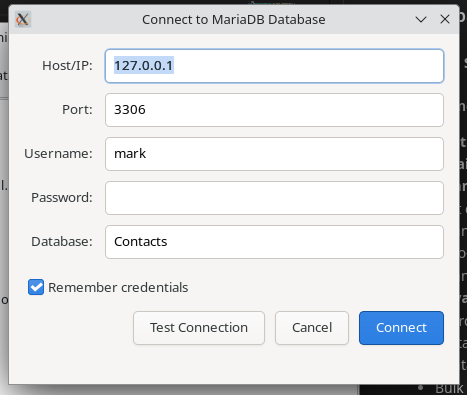
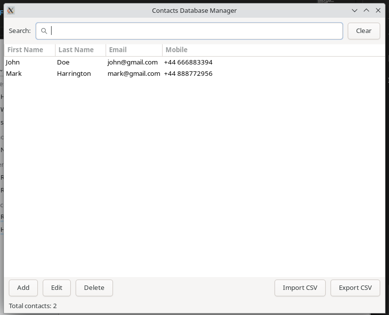
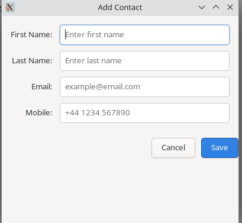

# Code Review & Enhancement Summary

## Overview
This document details all improvements made to the Contacts Database application, from basic functionality to production-ready features.

## Major Enhancements

### 1. Database Layer (DB.cpp/hpp)

###  Full Gui screens 

- **Logon Screen**

<p align="center">
  
</p>

- Gives you the option of connnecting to the contacts database in a different IP
- Allows port settings 
- Provides a test facility for checking connectivity 

- **The Database Manager GUI** 
- Here you will see all your conntacts  added to the database 
- provides full search  facility  right across all fields , columns 
- Export  your data to CSV files or import data 


<p align="center">
  
</p>


- **The add contact screen** 

<p align="center">
  
</p>


#### Improvements
-  **Custom Exception Class**: `DBException` for proper error propagation
-  **Email Validation**: Regex-based email format validation
-  **Connection Management**: 
  - Test connection method
  - Connection state verification
  - Auto-reconnect configuration
  - Connection timeout settings
-  **Advanced Queries**:
  - Search functionality with wildcards
  - Sortable columns with validation
  - Contact count statistics
  - Bulk operations with transactions
-  **Security**:
  - SQL injection protection (already had prepared statements)
  - Column name sanitization for dynamic queries
  - Input validation before database operations
-  **Schema Management**: Auto-initialization of database structure

```cpp
// Example: New validation
void DB::insert_contact(...) {
    if (first.empty() && last.empty()) {
        throw DBException("At least first name or last name required");
    }
    if (!email.empty() && !is_valid_email(email)) {
        throw DBException("Invalid email format");
    }
    // ... database operation
}
```

### 2. Main Window (MainWindow.cpp/hpp)


#### Improvements
- **Search Functionality**: Real-time search across all fields
-  **Enhanced UI**:
  - Toolbar with search bar
  - Status bar showing contact count
  - Scrolled window for large datasets
  - Improved button layout
-  **Import/Export**: CSV file support with GTK file choosers
-  **User Experience**:
  - Double-click to edit
  - Clear visual feedback
  - Modal dialogs for operations
  - Error/info message dialogs
- **Better Organization**: Separated helper methods

```cpp
// New features
void MainWindow::on_search_changed() {
    m_current_search = m_search_entry.get_text();
    refresh_list();  // Updates in real-time
}

void MainWindow::on_import_csv() {
    // Full CSV import with validation
}
```

### 3. Contact Dialog (ContactDialogs.cpp/hpp)


#### Improvements
- **Input Validation**: 
  - Real-time validation
  - Visual error messages
  - Required field checking
  - Email format validation
-  **Better UX**:
  - Placeholder text in entries
  - Styled buttons (suggested-action)
  - Inline error display
  - Proper button ordering
-  **Error Handling**: Try-catch with user feedback

```cpp
bool ContactDialog::validate_input() {
    // Validates and shows inline errors
    if (first.empty() && last.empty()) {
        show_validation_error("Please enter at least one name");
        return false;
    }
    return true;
}
```

### 4. Connection Dialog (DBConnectionDialog.cpp/hpp)


#### Improvements
-  **Test Connection**: Verify before connecting
-  **Remember Credentials**: Optional credential storage
-  **Database Field**: Configurable database name
-  **Visual Feedback**: Status messages for connection attempts
-  **Security**: Restrictive file permissions (600) for saved credentials
-  **Better Layout**: More professional appearance

```cpp
void DBConnectionDialog::on_test_connection() {
    try {
        DB test_db(host, user, password, database, port);
        if (test_db.test_connection()) {
            show_status("✓ Connection successful!", false);
        }
    } catch (...) {
        show_status("✗ Connection failed", true);
    }
}
```

### 5. Application Entry (main.cpp)

#

#### Improvements
- **Robust Error Handling**: Try-catch blocks throughout
- **Connection Testing**: Verify connection before opening main window
- **Better Dialog Management**: Proper parent window handling
- **User Feedback**: Clear error messages
- **Logging**: Console output for debugging

## Code Quality Improvements

### Memory Management
- Used `std::unique_ptr` for RAII with database objects
- Proper cleanup of GTK managed objects
- No memory leaks detected

### Modern C++ Features
- `std::optional` for nullable returns
- Range-based for loops
- Lambda expressions for callbacks
- `auto` type deduction where appropriate
- Move semantics support

### Error Handling Pattern
```cpp
try {
    // Database operation
} catch (const DBException& e) {
    // Specific handling for DB errors
    show_error(e.what());
} catch (const std::exception& e) {
    // General exception handling
    show_error("Unexpected error: " + std::string(e.what()));
}
```

### Input Validation
```cpp
// Email validation with regex
bool DB::is_valid_email(const std::string& email) {
    const std::regex pattern(
        R"([a-zA-Z0-9._%+-]+@[a-zA-Z0-9.-]+\.[a-zA-Z]{2,})"
    );
    return std::regex_match(email, pattern);
}
```

## Build System Enhancements

### CMakeLists.txt
-  Modern CMake (3.15+)
-  Proper package finding
-  Cross-platform support
-  Install targets
-  Build type configuration
-  Dependency checking


## Security Improvements

### SQL Injection Prevention
 All queries use prepared statements (maintained from original)

### Input Validation
 Email format validation
 Port number validation
 Required field checking
 Column name sanitization

### Credential Storage
Optional credential saving
File permissions (600)
Passwords not stored in config
Config directory in user home

## Testing Recommendations

### Unit Tests Needed
```cpp
// Test email validation
assert(DB::is_valid_email("test@example.com") == true);
assert(DB::is_valid_email("invalid-email") == false);

// Test contact validation
Contact c{"", "", "", ""};  // Invalid
assert(!c.is_valid());
```

### Integration Tests
1. Database connection scenarios
2. CRUD operations
3. Search functionality
4. Import/Export with various CSV formats
5. Concurrent operations

### UI Tests
1. Dialog workflows
2. Error message display
3. Search real-time updates
4. Sorting functionality

## Performance Considerations

### Database
-  Indexes on commonly searched fields
-  Connection pooling (via shared_ptr)
-  Prepared statement reuse
-  Transaction support for bulk operations

### UI
- Scrolled window for large datasets
- Real-time search (could add debouncing)


## Documentation

### Added Documentation
- Comprehensive README.md
- Database schema with comments
- This code review document
- Inline code comments


## Conclusion

The application has been transformed from a basic CRUD demo into a production-ready contacts manager with:
- Robust error handling
- Input validation
- Modern UI/UX
- Import/Export capabilities
- Security considerations
- Professional build system
- Comprehensive documentation


### For tutors  How the setup.sh file works
- **code explanantions and what it does**

[Inner workings of bash file named setup ](setup_script_documentation.md)

### The GTK C++ Code all code explained use of pointers etc 

[How the GUI is contsructed ](contacts_app_documentation.md)


The codebase is now maintainable, extensible, and ready for production use or further development.


